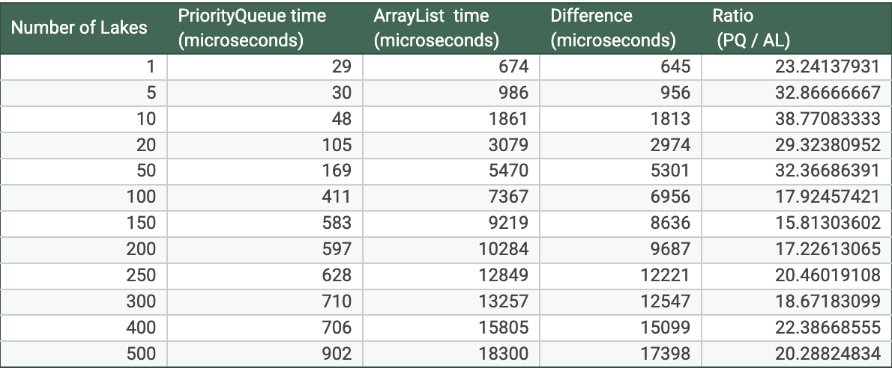

# Lake Environmental Risk Analyzer

**Author:** Tyler Roberts <br>
**Developed:** March 2026 <br>
**Context:** Project developed as part of CS231 (Data Structures & Algorithms) at Colby College

## Overview

This Lake Environmental Risk Analyzer is a Java program that evaluates ecological risk across lakes in Maine using a publically availible dataset. The program loads lake data from a CSV dataset, constructs lake objects, calculates a composite environmental risk score using a custom model, and ranks lakes using a PriorityQueue. 

The project also includes a performance comparison between a PriorityQueue and an ArrayList, demonstrating why a priority queue is significantly more efficient for retrieving the highest-risk lakes.

This project was inspired by prior work in environmental data analysis using tools such as pandas and geopandas. A key challenge in the dataset was the presence of substantial missing data, which motivated the inclusion of both a risk score and a confidence score for each lake. While the model aims to approximate environmental risk, the primary goal of the project is to build a complete data pipeline and explore the impact of data structure choice on performance.

---

## Project Structure

LakeAnalyzer.java   - Main program that loads data and runs the analysis
Lake.java           - Data structure representing a lake
RiskModel.java      - Environmental risk scoring model
MaineLakes.csv      - Dataset used for analysis
README.md           - Project documentation


# How the Program Works

The analysis pipeline consists of several stages:

### 1. Load Dataset

The program reads lake data from a CSV file:

```
MaineLakes.csv
```

Each row contains information such as:

* lake name
* mean depth
* trophic category
* drainage area
* flushing rate
* invasive species status

A buffered reader is used to efficiently read the file line by line.

---

### 2. Create Lake Objects

Each row in the dataset is converted into a `Lake` object containing:

* identifying information
* physical characteristics
* watershed characteristics
* environmental indicators

These objects serve as the core data structure used by the analysis model.

---

### 3. Environmental Risk Model

The `RiskModel` class evaluates each lake using several environmental indicators.

The model generates two outputs:

* risk score
* confidence score

### Risk Score

The risk score represents the estimated ecological vulnerability of the lake.

Factors used include:

* Mean depth - Shallow lakes warm faster and are more susceptible to eutrophication.
* Flushing rate - Low flushing allows pollutants and nutrients to accumulate.
* Water Quality - Direct feedback on the quality of the water.
* Trophic category - Indicates nutrient status and productivity of the lake.
* Invasive species - Presence of invasives increases ecological stress.

These factors are combined to generate a normalized **risk score between 0 and 1**.

---

### Confidence Score

Environmental datasets frequently contain missing data.

Instead of discarding incomplete lakes entirely, the model calculates a **confidence score** based on how many indicators were available.

Higher confidence indicates more reliable predictions.

---

### 4. Ranking Lakes

A **PriorityQueue** is used to rank lakes by risk score.

This allows efficient retrieval of the highest-risk lakes without sorting the entire dataset.
For comparison, the program also times how long the same process takes to run with an ArrayList that repeatedly scans the list to find the next highest-risk lake. This provides a comparison between the two methods. 

### 5. Performance Comparison

The program measures execution time for retrieving the top n lakes using both a PriorityQueue and an ArrayList approach.

Results show that the PriorityQueue is significantly more efficient, as it avoids repeatedly looping through the entire list to find and remove the highest risk lake. 

## Performance Comparison Table


---

# Command Line Usage

### Compile the program

```
javac *.java
```

### Run with default output

```
java LakeAnalyzer
```

This prints the **top 50 lakes by environmental risk**.

---

### Specify number of lakes

You can provide a command-line argument from **1 to 500**:

```
java LakeAnalyzer 10
```

Example output:

```
Lily Pond | Risk: 0.842 | Confidence: 0.71
Sebago Lake | Risk: 0.815 | Confidence: 0.76
Moosehead Lake | Risk: 0.781 | Confidence: 0.69
```

If an invalid argument is provided, the program defaults to **50 lakes**.

---

# Data Structure Design
The project uses several core data structures:
### Lake Class
Stores environmental attributes and model results.
### RiskModel Class
Implements the ecological risk scoring algorithm.
### PriorityQueue
Efficiently ranks lakes by environmental risk.

---

# Future Improvements
* Visualizing risk distributions
* Expanding model features
* Supporting additional sorting/filtering options

---

# Acknowledgements
This project was developed as part of coursework at Colby College.
* The dataset and initial inspiration came from ES347: Smart Earth – AI and Remote Sensing for Environmental Challenges.
* Thanks to Professor Ortiz for introducing the dataset and environmental context.
* Thanks to Professor Lage for guidance on data structures and performance analysis.

Additional resources:
* W3Schools — Java I/O and BufferedReader usage
* Online documentation and tools for CSV parsing and string handling
* Exploratory data analysis performed using Python (pandas, JupyterLab)
